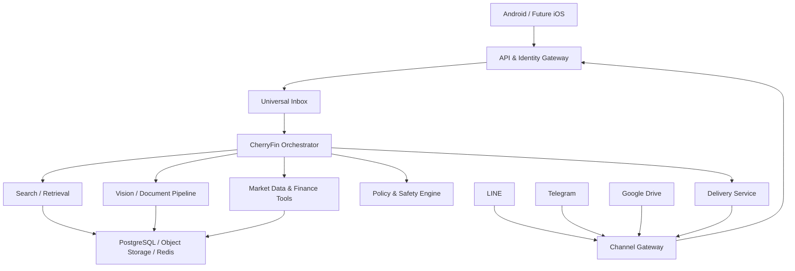

# CherryFin Full System Design

**Document status:** Proposed architecture  
**Product:** CherryFin — AI Accounting, Startup CFO & Company Launch Assistant  
**Initial platform:** Android-first, iOS-ready, LINE, Telegram, Google Drive  
**Design principle:** Full-system foundation, deliberately small Phase 1

---

## 1. Executive Summary

CherryFin is a Thailand-first, accounting-first AI assistant. Its daily core is receiving business documents, extracting accounting facts, proposing traceable debit/credit drafts, detecting duplicates and missing evidence, preparing monthly-close and tax-ready work, and routing every material judgment to a human reviewer. Company launch, Startup CFO analytics, tax, and multi-asset investment research extend this accounting core. It starts as an assistant—not a licensed accountant, tax adviser, lawyer, auditor, broker, autonomous trader, or government filing system.

The system is designed as an extensible financial operating layer:

- **Phase 1:** Ask, search, analyze, recommend, and send—focused first on accounting questions, document extraction, draft entries, evidence review, tax readiness, and business reporting.
- **Later:** Company workspace, bookkeeping operations, tax calendar, management reporting, startup analytics, portfolio intelligence, LYRA-9 integration, and carefully gated execution.

All client surfaces use one backend and one identity model. Android, future iOS, LINE, Telegram, and Google Drive are channels—not separate products. Every inbound message enters a Universal Inbox, is normalized into one conversation event format, routed through an orchestrator, uses approved tools, and produces a source-grounded answer.

The central product promise is:

> Send CherryFin an invoice, receipt, statement, or accounting export; let it extract the evidence, propose how to record it, explain the tax implications, ask for missing facts, and prepare a reviewable accounting result.

---

## 2. Product Scope

### 2.1 Phase 1 user outcomes

A user can:

1. Ask financial and investment questions in Thai or English, including questions about SET/mai stocks, NYSE/Nasdaq stocks, ETFs, funds, and crypto assets.
2. Search current public market information and receive cited answers with exchange, currency, market status, and data timestamp.
3. Attach a chart image, screenshot, PDF, CSV, or spreadsheet for analysis.
4. Search selected files in Google Drive.
5. Ask CherryFin to send or save an answer through LINE, Telegram, or Google Drive.
6. Reopen conversation history and see which sources/tools produced an answer.
7. Receive a clear distinction between facts, calculations, AI interpretation, and missing information.
8. Ask how to establish and operate a Thai company and receive a current, official-source-backed checklist.
9. Analyze invoices, receipts, withholding-tax certificates, account exports, financial statements, cap tables, budgets, and tax-related documents.
10. Calculate burn rate, runway, gross margin, break-even, MRR/ARR, CAC, LTV, cash-flow scenarios, and common accounting/tax examples using deterministic tools.
11. Build a compliance calendar and document checklist without CherryFin silently filing or signing anything on the user's behalf.
12. Review an accounting inbox containing extracted documents, proposed categories and debit/credit lines, duplicate/missing-document warnings, confidence, evidence locations, and reviewer status.

### 2.2 Explicit Phase 1 non-goals

Phase 1 does **not** include:

- Autonomous trading.
- Exchange order placement.
- Withdrawal permissions.
- Posting to a statutory ledger or operating a complete double-entry bookkeeping system; Phase 1 may prepare balanced, evidence-linked draft entries for human review.
- Automatic bank synchronization.
- Automatic government registration, tax filing, digital signing, certification, or payment.
- Strategy backtesting or ML training.
- A swarm of agents debating each other.
- Guaranteed returns, price predictions, or invented market data.

### 2.3 Long-term capability map

| Domain | Phase 1 | Later extension |
|---|---|---|
| Financial Q&A | General and source-grounded | Personalized financial planning |
| Company launch | Thailand-first official-source checklists and document guidance | Company workspace, stakeholder/cap-table records, filing workflow |
| Accounting | Explain and analyze uploaded business/accounting data | Ledger, AR/AP, reconciliation, close, financial statements |
| Tax | Explain obligations and build dated checklists | Tax calendar, evidence packs, accountant review, filing integrations where lawful and available |
| Startup CFO | Deterministic metrics from user-provided data | Runway forecasting, scenarios, KPI board, investor data room |
| Asset coverage | Thai/US equities, ETFs, funds, crypto, FX, commodities | More countries, venues, and licensed datasets |
| Search | Web, market sources, selected Drive files | Regulatory filings and premium datasets |
| Vision | Chart/document understanding | Numeric chart reconstruction and multi-timeframe verification |
| Personal finance | File-based summaries | Ledger, budget, debt, cash-flow forecast |
| Portfolio | User-provided file analysis | Live holdings, allocation, exposure, rebalance suggestions |
| Trading | Educational analysis only | Paper trading, LYRA-9, backtest, guarded live execution |
| Delivery | LINE, Telegram, Drive | Email, reports, schedules, team workspaces |

---

## 3. Architecture Principles

1. **Assistant first, automation later.** Recommendations and information delivery are safe defaults.
2. **One core, many channels.** Mobile and messaging integrations share the same conversations, tools, and policies.
3. **Ground answers in evidence.** Current facts require sources and timestamps.
4. **Images are clues, not truth.** A chart screenshot is interpreted visually and, when possible, verified against raw market data.
5. **Deterministic finance math.** Calculations use code and validated data, not free-form LLM arithmetic.
6. **Accounting evidence before entry.** Every draft line links to its source document, extracted field, rule/formula version, and reviewer decision.
7. **Least privilege.** Connectors receive only the permissions required for their task.
8. **No silent financial action.** Higher-risk capabilities require explicit approval and immutable audit records.
9. **Provider independence.** LLM, vision, search, market data, and storage providers are behind internal interfaces.
10. **Truth over visual theater.** Missing values remain missing; the system never creates fake PnL, signals, order books, or confidence.
11. **Ops-first.** Every request has trace IDs, tool logs, latency metrics, retry state, and a diagnosable failure path.

---

## 4. Full Logical Architecture



### 4.1 Client layer

#### Mobile app

- React Native with Expo.
- Android is the tested and distributed target in Phase 1.
- The same codebase remains iOS-compatible.
- Local responsibilities: UI, secure token storage, attachment selection, upload progress, cached conversation list, notification handling.
- The app does not store provider secrets or call financial/exchange providers with server credentials.

#### Messaging channels

- LINE Official Account for Thai daily use.
- Telegram Bot for rapid testing, commands, groups, and operational notifications.
- Each channel is implemented as an adapter behind the Channel Gateway.

#### Google Drive

- OAuth connection per user.
- Use narrow per-file access (`drive.file`) whenever possible.
- Supports selecting input files, saving generated reports, and optionally watching a user-designated CherryFin folder in a later phase.

### 4.2 API & Identity Gateway

Responsibilities:

- User authentication and refresh tokens.
- OAuth account linking.
- Mobile API versioning.
- Request validation, rate limiting, idempotency, and trace IDs.
- Mapping LINE/Telegram identities to a CherryFin user.
- Issuing one-time link codes for safe channel linking.

Identity is never inferred from a display name. A user links a channel through a short-lived code generated inside the authenticated app.

### 4.3 Channel Gateway

The Channel Gateway provides a stable adapter contract:

```text
verifyWebhook(rawRequest)
parseInbound(rawRequest) -> NormalizedEvent[]
downloadAttachment(attachmentRef)
sendReply(destination, content)
sendPush(destination, content)
formatCapabilities() -> ChannelCapabilities
```

Required controls:

- Verify LINE signatures against the raw request body.
- Validate Telegram webhook secrets.
- Deduplicate redelivered events using provider event/message IDs.
- Acknowledge webhooks quickly and move slow work to a queue.
- Preserve conversation, sender, thread, attachment, and reply-token metadata.
- Redact tokens and private content from logs.

### 4.4 Universal Inbox

Every inbound event becomes one internal format:

```json
{
  "eventId": "evt_...",
  "userId": "usr_...",
  "channel": "mobile|line|telegram|drive",
  "conversationId": "conv_...",
  "type": "text|image|document|command|delivery_request",
  "text": "optional user text",
  "attachments": [],
  "receivedAt": "ISO-8601",
  "sourceEventId": "provider message/event id",
  "traceId": "trace_..."
}
```

This prevents business logic from being duplicated across mobile, LINE, Telegram, and Drive.

### 4.5 CherryFin Orchestrator

Phase 1 uses **one orchestrator with tools**, not multiple autonomous personas.

The orchestrator performs:

1. Intent classification.
2. Data sensitivity and risk classification.
3. Tool planning.
4. Tool execution through allowlisted schemas.
5. Evidence collection.
6. Answer composition.
7. Output policy check.
8. Delivery or user confirmation.

Example intents:

- `finance.question`
- `company.launch`
- `company.compliance`
- `accounting.question`
- `accounting.document_analyze`
- `tax.question`
- `tax.calendar`
- `startup.metrics`
- `market.lookup`
- `web.research`
- `chart.analyze`
- `document.summarize`
- `drive.search`
- `answer.send`
- `answer.save`

The future “agents” such as CFO, Research, Portfolio, Chart Vision, and LYRA-9 should initially be capability modules or prompt/policy profiles under this orchestrator. They become separate workers only when isolation, scale, or independent state truly requires it.

### 4.6 Tool Registry

Every tool has:

- Name and version.
- JSON input/output schema.
- Required permissions.
- Risk level.
- Timeout and retry policy.
- Data classification.
- Whether explicit confirmation is required.
- Audit fields and cost metrics.

Phase 1 tools:

| Tool | Purpose | Risk |
|---|---|---|
| Web search | Find current public information | Low |
| URL reader | Retrieve a selected source | Low |
| Market quote | Current/delayed quote with timestamp | Low |
| Finance calculator | Return, allocation, DCA, FX, risk/reward | Low |
| Startup calculator | Runway, burn, break-even, MRR/ARR, CAC/LTV, scenarios | Low |
| Company-launch research | Retrieve current official registration guidance and checklists | Low |
| Accounting/tax research | Retrieve current official rules, forms, deadlines, and explanations | Medium |
| Business document extractor | Extract invoices, receipts, statements, certificates, cap tables, and budgets | Medium |
| Chart vision | Interpret uploaded chart image | Medium |
| Document reader | Extract and summarize user files | Medium |
| Drive search/read | Access user-selected files | Medium |
| LINE/Telegram sender | Send to linked destination | Medium; confirm destination |
| Drive writer | Save generated output | Medium; confirm file/folder |

Future trading tools are not registered in Phase 1 deployments.

### 4.7 Search and Retrieval

Retrieval sources are separated by trust class:

1. **Authoritative:** Regulators, exchanges, issuer disclosures, company filings, and official documentation. Thailand-first business sources include DBD Biz Regist/DBD services and Revenue Department e-Filing/e-Tax information. For equities this includes the relevant exchange, Thai SEC/SET disclosures, US SEC filings, and issuer investor-relations sources where applicable.
2. **Market data:** Licensed or approved quote/OHLCV providers.
3. **News:** Selected current news providers.
4. **User-private:** Files explicitly selected from Google Drive or uploaded by the user.
5. **General web:** Discovery source requiring additional verification for high-impact claims.

Each retrieved item records source URL or file ID, retrieval time, publication time when available, content hash, and tool version.

### 4.8 Vision and Document Pipeline

Supported inputs:

- Chart screenshots.
- Broker/exchange screenshots.
- Receipts and payment slips.
- Tax invoices, e-Tax documents, withholding-tax certificates, and payroll summaries.
- Bank statements, accounting exports, trial balances, and financial statements.
- Cap tables, shareholder lists, budgets, forecasts, and investor data-room files.
- PDF reports.
- CSV/XLSX portfolio exports.
- General financial images.

Pipeline:

1. Validate MIME type and file size.
2. Malware scan and safe decoding.
3. Store original encrypted object.
4. OCR and layout extraction.
5. Vision-model interpretation.
6. Structured extraction with confidence per field.
7. Deterministic calculations.
8. Optional external-data verification.
9. Produce evidence-linked analysis.

For a chart image, the extractor attempts to identify:

- Asset/symbol and venue.
- Timeframe.
- Visible time range.
- Price-axis values.
- Indicators and their parameters.
- Candlestick/market structure.
- Volume and annotations.
- Whether key context is cropped or unreadable.

If symbol, timeframe, or current price cannot be determined reliably, the answer states the limitation. It must not silently guess.

### 4.9 Market Data and Finance Tools

Market support is multi-asset. Phase 1 prioritizes:

- Thai equities on SET and mai.
- US equities on NYSE and Nasdaq.
- Exchange-traded funds (ETFs).
- Mutual-fund/NAV information when a reliable source is available.
- Crypto spot markets and USDT-denominated assets.
- FX and commodity reference prices used in financial comparisons.

Every instrument is normalized to a canonical identity instead of relying on ticker text alone:

```json
{
  "assetId": "canonical internal id",
  "assetClass": "equity|etf|fund|crypto|fx|commodity",
  "symbol": "venue symbol",
  "venue": "SET|MAI|NYSE|NASDAQ|crypto venue|other",
  "country": "ISO country code when applicable",
  "quoteCurrency": "THB|USD|USDT|other",
  "timezone": "IANA timezone",
  "tradingCalendar": "calendar id"
}
```

The internal provider interface should support:

```text
getQuote(symbol, venue)
getCandles(symbol, venue, timeframe, from, to)
getAssetMetadata(symbol, venue)
getFxRate(base, quote, timestamp)
getCorporateAction(symbol, range)
getMarketSession(venue, timestamp)
getFundamentals(symbol, venue, period)
getFilings(symbol, venue, range)
```

Phase 1 should start provider-light and read-only. Every displayed price must identify whether it is real-time, delayed, or end-of-day and must include its timestamp, venue, and quote currency. Equity candles and returns must declare whether corporate actions such as splits and dividends are adjusted. Raw data is cached with timestamps and provenance. Calculated indicators are generated internally so the calculation method and parameters remain reproducible.

### 4.10 Delivery Service

Output types:

- Plain chat response.
- Compact LINE/Telegram message.
- Rich card where supported.
- Markdown report.
- PDF/CSV in later phases.
- Saved Google Drive file.

Before sending to a person, group, or folder, the UI displays the resolved destination and a preview. Repeated scheduled delivery is a later capability and is disabled until destination permissions and opt-out behavior are implemented.

---

## 5. AI and Model Architecture

### 5.1 Model Gateway

All model calls use an internal OpenAI-compatible Model Gateway. This supports:

- Local Qwen through vLLM/SGLang/Ollama.
- A separate vision-capable model.
- Optional hosted fallback, controlled by policy.
- Model routing based on task, privacy, latency, and cost.
- Prompt/version tracking.
- Token and latency metrics.

### 5.2 Suggested routing

| Workload | Route |
|---|---|
| Simple conversation | Small/fast local language model |
| Financial synthesis | Strong reasoning language model |
| Chart/image/document | Vision-language model plus OCR |
| Calculations | Deterministic code tool |
| Current facts | Search/retrieval first, then language model |
| Private Drive content | Local/private route unless user policy allows otherwise |

### 5.3 Answer contract

A finance/investment answer should be internally represented as:

```json
{
  "summary": "short direct answer",
  "facts": [],
  "analysis": [],
  "recommendations": [],
  "risks": [],
  "unknowns": [],
  "sources": [],
  "dataAsOf": "ISO-8601",
  "confidence": "high|medium|low"
}
```

The user interface can render this naturally without forcing every response into a rigid template.

### 5.4 Memory

Memory is separated into:

- Conversation history.
- User preferences: language, currency, markets of interest, explanation level.
- Saved research and bookmarks.
- Connected-channel identities.
- Future financial profile, isolated behind stricter permissions.

No financial fact is promoted into long-term memory solely because the LLM stated it. Structured user confirmation or a trusted source is required.

---

## 6. Core Data Model

### 6.1 Phase 1 tables

| Table | Purpose |
|---|---|
| `users` | Core account and locale |
| `auth_identities` | Login identities and channel links |
| `connections` | LINE, Telegram, Drive OAuth metadata |
| `conversations` | Cross-channel conversation container |
| `messages` | Normalized inbound/outbound messages |
| `attachments` | Encrypted object references and extraction state |
| `agent_runs` | Orchestrator execution and outcome |
| `tool_calls` | Tool inputs/outputs metadata and status |
| `sources` | URLs/files, timestamps, hashes, provenance |
| `deliveries` | Destination, preview, status, retry state |
| `user_preferences` | Language, currency, markets, risk explanation |
| `audit_events` | Immutable security and action audit |

### 6.2 Later bounded contexts

Do not add these tables until their phase begins:

- Finance ledger: accounts, transactions, categories, budgets, recurring items.
- Company workspace: legal entity profile, founders, directors, shareholders, registered capital, fiscal period, VAT status, document checklist, and compliance tasks.
- Accounting operations: chart of accounts, journal entries, invoices, receipts, AR/AP, bank reconciliation, close periods, and financial statements.
- Tax operations: tax profile, obligations, calendar, forms, withholding records, VAT evidence, filing status, payments, and accountant approvals.
- Startup intelligence: cap table, funding rounds, budgets, forecasts, KPI definitions, metric snapshots, runway, scenarios, and investor data-room index.
- Portfolio: holdings, lots, valuations, allocation snapshots.
- Research: watchlists, theses, alerts, filing extracts.
- Trading: plans, signals, orders, fills, positions, outcomes, journal snapshots.
- Strategy lab: datasets, experiments, backtests, model versions.

This preserves a clean Phase 1 schema while reserving clear module boundaries.

---

## 7. Key End-to-End Flows

### 7.1 Process an accounting document

1. User uploads an invoice, receipt, statement, withholding-tax certificate, spreadsheet, or accounting export.
2. Document pipeline extracts parties, tax IDs, document number, dates, currency, subtotal, VAT, withholding tax, total, payment state, and field-level evidence/confidence.
3. Deterministic rules detect duplicates, arithmetic inconsistencies, missing required fields, and accounting-period conflicts.
4. CherryFin proposes category, debit/credit draft lines, tax treatment questions, and required supporting documents; uncertain items remain unresolved.
5. User or accountant confirms, corrects, or rejects the draft. The decision and changes are audited and become feedback data.
6. Phase 1 stores a confirmed review result but does not silently post to a statutory ledger or file a tax return.

### 7.2 Build a company-launch or tax checklist

1. User states jurisdiction, intended entity type, founders/shareholders, business model, expected revenue, hiring plan, and target launch date.
2. Orchestrator retrieves current information from authoritative DBD, Revenue Department, and other applicable government sources.
3. Deterministic rules generate a dated checklist, required-document list, decision points, and unresolved questions.
4. Answer separates official requirements, general guidance, user assumptions, and items requiring confirmation by an accountant, lawyer, auditor, or government officer.
5. User can save the checklist to Drive or send it through LINE/Telegram.
6. Phase 1 does not submit, sign, certify, or pay a government filing.

### 7.3 Ask a current investment question

1. User asks from Android or a bot.
2. Gateway resolves identity and conversation.
3. Orchestrator marks the question as current/high-impact.
4. Search and market-data tools retrieve current evidence.
5. Finance calculator performs any numeric work.
6. Model composes an answer with source timestamps and risk notes.
7. Response is stored and returned to the originating channel.

### 7.4 Analyze a chart screenshot

1. User uploads a chart with an optional question.
2. Attachment is scanned, stored, OCR'd, and passed to vision analysis.
3. Extractor records symbol/timeframe/indicators with confidence.
4. If sufficient identifiers exist, CherryFin fetches matching OHLCV for verification.
5. Deterministic indicator tools recompute relevant values.
6. Answer explains visible structure, limitations, possible scenarios, and invalidation—without presenting certainty as fact.
7. Original image, structured extraction, sources, and answer are linked for audit.

### 7.5 Search Google Drive and send a summary

1. User connects Drive using OAuth.
2. User selects or searches files permitted to CherryFin.
3. Document pipeline extracts the selected content.
4. CherryFin summarizes or compares it.
5. User selects a linked LINE/Telegram destination.
6. System shows destination and preview.
7. User confirms; Delivery Service sends and records status.

### 7.6 Cross-channel continuity

1. User links LINE and Telegram to the same CherryFin account.
2. A conversation started in LINE appears in Android history.
3. The user opens it in Android, attaches a larger document, and requests a Telegram delivery.
4. All events remain in one conversation with channel-specific message records.

---

## 8. API Surface

### 8.1 Mobile APIs

```text
POST   /v1/auth/login
POST   /v1/auth/refresh
GET    /v1/me
GET    /v1/conversations
POST   /v1/conversations
GET    /v1/conversations/{id}/messages
POST   /v1/conversations/{id}/messages
POST   /v1/attachments
GET    /v1/runs/{id}
GET    /v1/accounting/drafts
GET    /v1/accounting/drafts/{id}
POST   /v1/accounting/drafts/{id}/confirm
POST   /v1/accounting/drafts/{id}/correct
POST   /v1/accounting/drafts/{id}/reject
POST   /v1/deliveries/preview
POST   /v1/deliveries/{id}/confirm
GET    /v1/connections
POST   /v1/connections/{provider}/link
DELETE /v1/connections/{provider}
```

### 8.2 Provider webhooks

```text
POST /v1/webhooks/line
POST /v1/webhooks/telegram/{secretPath}
POST /v1/webhooks/google-drive
```

### 8.3 Internal worker contracts

```text
inbox.normalize
attachment.process
agent.run
tool.execute
delivery.send
delivery.retry
audit.append
```

Long-running requests return a run ID. Clients subscribe through server-sent events or poll run status. Webhooks are acknowledged before long model/tool work begins.

---

## 9. Security, Privacy, and Financial Safety

### 9.1 Security controls

- TLS everywhere.
- Passwordless/OAuth login where practical.
- Short-lived access tokens and rotated refresh tokens.
- Encrypt OAuth refresh tokens with a dedicated key-management secret.
- Encrypted object storage for user attachments.
- Per-user access checks on every conversation, attachment, and connection.
- Strict webhook signature verification and replay protection.
- Rate limits per user, IP, provider, and tool.
- Secrets never exposed to the model context.
- Log redaction for tokens, account identifiers, and document content.
- Dependency and image vulnerability scanning in CI.
- Backups with restore drills.

### 9.2 Tool safety levels

| Level | Example | Behavior |
|---|---|---|
| 0 Read-only public | Web search, public quote | Execute automatically |
| 1 Read-only private | Read selected Drive file | Execute within granted scope |
| 2 External communication | Send LINE/Telegram, write Drive | Preview and confirm |
| 3 Financial mutation | Update portfolio/ledger | Explicit confirmation and audit |
| 4 Financial execution | Place/cancel order | Disabled until a later approved phase |

### 9.3 Advice presentation

CherryFin must:

- Show when market data was retrieved.
- Separate facts from interpretation.
- State important unknowns and conflicts.
- Avoid promises of return or certainty.
- Avoid giving a precise trade action from an unreadable or unverifiable screenshot.
- Use scenario language and explain invalidation for technical analysis.
- Require user-defined risk context before later personalized recommendations.

### 9.4 Company, accounting, and tax boundaries

- Every company-registration or tax answer identifies jurisdiction, entity type, source, publication/effective date when available, retrieval time, assumptions, and missing facts.
- CherryFin may explain, calculate examples, prepare drafts/checklists, and organize evidence; it does not represent that a company has been registered or a tax return has been filed without an authoritative receipt/status.
- Filing, signing, certification, audit opinions, and professional judgments require explicit user action and the appropriate licensed accountant, auditor, lawyer, tax professional, or government channel.
- Tax calculations are deterministic and versioned by rule/effective period. LLM-generated arithmetic or uncited rates are rejected.
- The system preserves source documents, transformation lineage, reviewer decisions, and calculation versions so every reported number can be traced back to evidence.
- High-impact answers default to official Thai sources and request clarification instead of guessing VAT status, accounting period, expense deductibility, withholding treatment, or filing deadline.

---

## 10. Deployment Architecture

### 10.1 Phase 1 deployment on existing Ubuntu/Proxmox infrastructure

```text
Reverse Proxy / TLS
  ├── API service
  ├── Channel Gateway service
  ├── Worker service
  ├── PostgreSQL
  ├── Redis
  ├── MinIO or S3-compatible object storage
  └── Model Gateway -> local vLLM/SGLang/Ollama endpoints
```

Use Docker Compose for the first working environment. Keep databases and model servers outside stateless application containers. Separate development, staging, and production secrets.

### 10.2 Later scale-out

- Multiple API and worker replicas.
- Managed or HA PostgreSQL.
- Redis with persistence appropriate to queue semantics.
- Object-store replication and lifecycle rules.
- Dedicated queues per workload: text, vision, document, delivery.
- Per-model concurrency and backpressure.
- Regional ingress only when usage justifies it.

### 10.3 Failure behavior

- If the LLM is unavailable, retain the user request and show queued/degraded state.
- If search fails, do not answer current facts from stale memory without labeling them.
- If a channel delivery fails, preserve the completed answer and offer retry.
- If Drive authorization expires, request reconnection without losing the conversation.
- If chart verification fails, provide visual observations with a clear unverified label.

---

## 11. Observability and Operations

Required telemetry:

- Request rate and error rate by endpoint/channel.
- End-to-end response latency.
- Queue depth and oldest-job age.
- Model latency, token usage, and failure rate.
- Tool latency and provider errors.
- Attachment processing duration and OCR/vision failure rate.
- Delivery success, retry, and duplicate rate.
- Source retrieval freshness.
- User confirmation/correction rate for analyses.

Every user request receives one `traceId` propagated across API, queue, orchestrator, tools, model calls, and delivery.

Initial service objectives:

- Webhook acknowledgement: under 2 seconds at p95.
- Normal text answer without external search: under 10 seconds at p95 when models are healthy.
- Search-backed answer: visible progress within 3 seconds; completion target under 30 seconds at p95.
- No duplicate outbound delivery for the same confirmed delivery ID.
- Restore tested backups, not merely successful backup jobs.

---

## 12. Repository Structure

```text
cherry-finance/
  apps/
    mobile/                 # Expo React Native
    api/                    # Public REST/SSE API
    worker/                 # Async jobs
  services/
    channel-gateway/
    model-gateway/
    delivery/
  connectors/
    line/
    telegram/
    google-drive/
    market-data/
    web-search/
  packages/
    agent-core/
    tool-registry/
    policy-engine/
    finance-math/
    schemas/
    observability/
    ui/
  infra/
    docker/
    migrations/
    monitoring/
  docs/
    architecture/
    api/
    runbooks/
    adr/
```

The repository can begin as a TypeScript monorepo for mobile, API, connectors, and shared schemas. A Python analysis service may be added later for quantitative research, backtesting, and ML without forcing the Phase 1 API into Python prematurely.

---

## 13. Delivery Phases

### Phase 0 — Foundation

- Monorepo and environments.
- API, database, Redis, object storage.
- Identity, conversations, messages, attachments.
- Model Gateway and first local model connection.
- Audit and tracing foundation.

### Phase 1A — Core Assistant

- Android chat interface.
- Thai/English Q&A.
- Web search and source-grounded responses.
- Current/delayed market lookup for SET/mai, NYSE/Nasdaq, ETFs, crypto, FX, and commodities, with venue, currency, market status, and data timestamp.
- Basic equity research from official disclosures, company information, price history, and deterministic financial calculations.
- Accounting-first Thai Q&A, document guidance, tax readiness, and company/startup support grounded in authoritative sources.
- Deterministic startup/accounting calculators for burn, runway, margin, break-even, MRR/ARR, CAC/LTV, VAT/WHT examples, and cash-flow scenarios.
- Conversation history.

### Phase 1B — Files and Vision

- Image/PDF/CSV upload.
- OCR and structured extraction for invoices, receipts, statements, withholding-tax certificates, trial balances, and financial statements.
- Accounting review inbox with proposed categories/debit-credit drafts, evidence links, duplicate/missing-document checks, and human confirm/correct/reject actions.
- Chart screenshot interpretation.
- Explicit limitations and verification state.

### Phase 1C — Connected Delivery

- Telegram inbound/outbound.
- LINE inbound/outbound.
- Google Drive OAuth, selected-file read, report save.
- Channel linking, destination preview, and confirmation.

### Phase 2 — Bookkeeping & Monthly Close

- Chart of accounts, journal entries, transaction imports, invoices, receipts, AR/AP, and bank reconciliation.
- Period locks, close checklist, adjusting-entry review, evidence completeness, and reviewer approvals.
- Profit and loss, balance sheet, cash flow, budget versus actual, and accountant export/evidence pack.

### Phase 3 — Tax & Compliance

- Tax obligation calendar, VAT/WHT evidence, e-Tax document support, accountant review queue, and filing/payment status.
- Versioned rules by effective period, reproducible calculations, and authoritative submission receipts/status.
- Data lineage from source document to extraction, draft, journal entry, tax treatment, reviewer, report, and exported evidence pack.

### Phase 4 — Company Launch & Startup CFO

- Guided Thai company-establishment workspace and dated task checklist.
- Entity, founder, director, shareholder, registered-capital, accounting-period, and VAT-status profile.
- Cap table, document pack, board/shareholder records, and investor data-room index.
- DBD/Revenue/other filing links and status evidence; no silent submission.
- Budget, forecast, burn, runway, gross margin, break-even, MRR/ARR, CAC/LTV, KPI board, and investor data room.

### Phase 5 — Personal Finance & Investment Intelligence

- Watchlists and portfolio imports.
- Multi-asset holdings across Thai stocks, US stocks, ETFs, funds, crypto, FX, and commodities.
- Allocation, currency exposure, country/sector concentration, dividends, corporate actions, and performance attribution.
- Company/asset research workspace with fundamentals, filings, valuation inputs, and source history.
- Verified technical-analysis pipeline and alerts.

### Phase 6 — LYRA-9 and Strategy Lab

- LYRA-9 as a bounded Strategy/Risk module.
- Trading Journal integration.
- Preserve 4H bias -> 15M validation -> 5M execution logic where applicable.
- Entry/exit chart display and live exit updates.
- Pre/post-exit snapshots, slippage, latency, missed-profit, and exit-efficiency evaluation.
- Backtest, walk-forward validation, and paper trading.
- No fake data and no automatic live activation.

### Phase 7 — Guarded Execution

- Separate execution service and credentials.
- No withdrawal permissions.
- Hard exposure/daily-loss limits and kill switch.
- Explicit arming and per-action approval policies.
- Reconciliation against exchange fills.
- Full immutable audit and incident runbooks.

Phase 7 is optional and should proceed only after paper-trading evidence, security review, and operational readiness.

---

## 14. Phase 1 Acceptance Criteria

Phase 1 is complete when:

1. A user installs an Android build and signs in.
2. The user asks a Thai financial question and receives a useful answer.
3. A current-market question includes asset class, symbol, venue, quote currency, market status, price mode (real-time/delayed/end-of-day), source, and data timestamp.
4. The user uploads a chart image and receives observations plus explicit limitations.
5. The system never invents unreadable symbol/timeframe/price values.
6. The same account can link LINE and Telegram through secure one-time codes.
7. A message sent from LINE appears in the Android conversation history.
8. The user can select a Drive file, summarize it, preview the destination, and send the result to Telegram or LINE.
9. Duplicate provider webhook events do not create duplicate answers.
10. Every response can be traced through model and tool executions without exposing private content in operational logs.
11. Degraded providers produce clear recoverable states instead of silent failure.
12. Financial responses separate factual data, analysis, risk, and unknowns.
13. A Thai company-launch/tax question returns official sources, jurisdiction, assumptions, effective/retrieval date, missing facts, and a professional-review boundary.
14. Startup/accounting calculations are reproducible from stored inputs and a versioned deterministic formula.
15. An uploaded accounting document produces field-level evidence, duplicate/missing-field checks, a reviewable debit/credit draft, and an audited human decision without silently posting to a ledger.

---

## 15. First Implementation Backlog

Recommended build order:

1. Repository scaffold and shared schemas.
2. PostgreSQL, Redis, object storage, API health checks.
3. Authentication and conversation/message APIs.
4. Model Gateway connected to the existing local OpenAI-compatible endpoint.
5. Android chat UI and attachment upload.
6. Tool Registry with finance calculator and web/market lookup.
7. Evidence/source rendering.
8. Vision/document pipeline.
9. Telegram adapter.
10. LINE adapter.
11. Google Drive OAuth and selected-file operations.
12. Delivery preview/confirmation.
13. Observability dashboards and first runbooks.
14. Security review and Phase 1 acceptance test.

---

## 16. Architecture Decisions to Lock

| Decision | Choice |
|---|---|
| Primary product focus | Thailand-first accounting, tax readiness, Startup CFO, and company launch |
| Daily product loop | Document -> extract -> draft entry -> validate -> human review -> report/tax readiness |
| Mobile technology | Expo React Native, Android-first/iOS-ready |
| Interaction model | One orchestrator with versioned tools |
| Channel model | Adapters feeding one Universal Inbox |
| Backend source of truth | PostgreSQL |
| Async work | Redis-backed queues |
| File storage | S3-compatible object storage |
| AI integration | Provider-independent OpenAI-compatible Model Gateway |
| Financial math | Deterministic code, never LLM-only |
| Drive access | OAuth with narrow per-file scope |
| External sending | Preview plus explicit confirmation |
| Trading in Phase 1 | Not present |
| Missing data | Display unknown/degraded state; never synthesize |

---

## 17. Final Product Shape

CherryFin evolves through bounded capability layers rather than one oversized first release:

```text
Phase 1: Ask + Search + Analyze + Send
Phase 2: Bookkeeping and monthly close
Phase 3: Tax and compliance
Phase 4: Launch and run my startup
Phase 5: Understand my money and investments
Phase 6: Test and learn strategies
Phase 7: Execute only behind hard controls
```

The Phase 1 product is intentionally simple for users: one conversation, attachments, connected sources, deterministic calculators, and send/save actions. The full architecture underneath ensures that company launch, accounting, tax, startup intelligence, portfolio, LYRA-9, and execution modules can be added without replacing the identity, conversation, channel, evidence, policy, or audit foundations.
